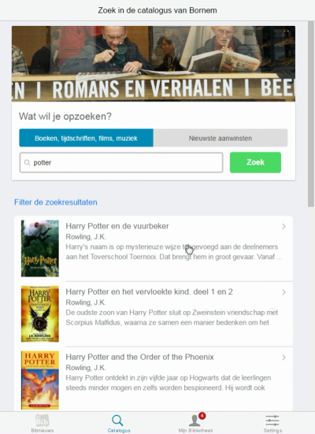

# bib-app

Ontwerp van een app voor de Vlaamse openbare bibliotheken. De versie die hier online staat is zeker nog niet af en eerder een vingeroefening in webdevelopment voor mezelf dan dat het de bedoeling is om deze in productie te brengen.

Gebouwd op basis van [Framework7](https://github.com/nolimits4web/Framework7), aangevuld met eigen javascript, php, css code. Maakt gebruik van de [Aquabrowser-catalogus API](http://www.cultuurconnect.be/diensten/bibliotheekportalen/api).

###Aanwezige functionaliteiten
* bibnieuws (rss-feed bibwebsite)
* zoeken in de catalogus
* infinite scroll als er veel zoekresulaten zijn
* beschikbaarheidsinformatie tonen
* reserveringen plaatsen
* switchen van bib (werkt voorlopig enkel bij bibs uit Provincie Antwerpen)

###To Do's
* betere detailpagina's maken
* implementatie van de Mijn Bibliotheek API (is nu gewoon een iframe) en een push-API, met als doel werkende notificaties (badge en meldingencentrum)
* bug bij zoeken naar aanwinsten weghalen (werkt nu niet)
* filters voor zoekresultaten toevoegen

##DEMO
Klik op het screenshot voor een demofilmpje

